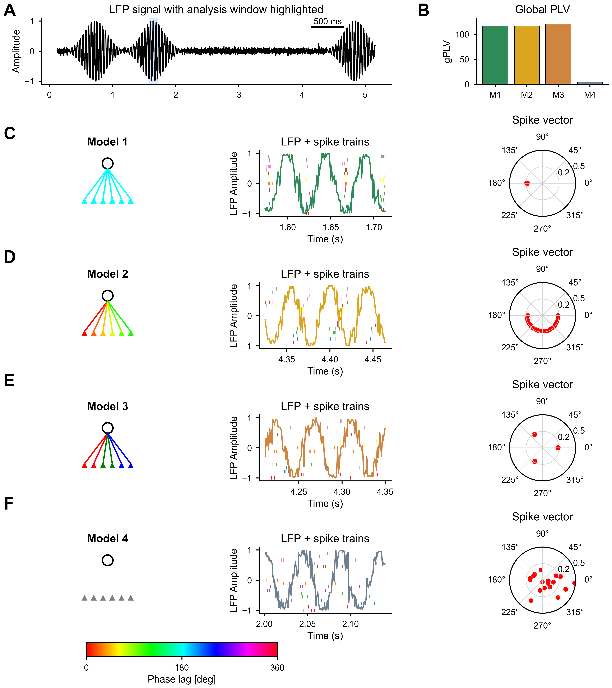

## Summary

PyGPLA is a Python implementation of Generalized Phase Locking Analysis (GPLA) for multivariate analysis of coupling between spikes and local field potentials (LFPs) [@safavi2023uncovering]. For a given frequency, GPLA constructs a complex coupling matrix $\hat{C}(f) \in \mathbb{C}^{N_c \times N_u}$ between LFP channels ($N_c$) and spike units ($N_u$), then applies singular value decomposition (SVD) to reduce the dimensionality of data. The leading singular value summarizes population-level coupling strength, while the corresponding singular vectors describe dominant LFP and spike coupling modes. PyGPLA accepts a user-provided frequency-specific analytic LFP signal or phase representation and provides data selection, optional whitening and normalization, coupling-matrix construction, SVD-based decomposition, and statistical significance testing [@safavi2021univariate].

## Statement of need

Neural recordings are becoming increasingly high-dimensional and multimodal, demanding more sophisticated analysis tools. Simultaneous analysis of spiking activity and LFPs is among the most informative multi-modal approaches in systems neuroscience, providing insight into the multi-scale mechanisms underlying cognitive functions such as attention and memory [@buzsaki2012origin; @einevoll2013modelling; @herreras2016local]. LFP oscillatory activity partly reflects subthreshold processes shared by neuronal ensembles, and the synchronization between this activity and spiking is hypothesized to coordinate neural populations during cognitive processes [@buzsaki2012origin; @hagen2016hybrid].

However, commonly used spike-LFP coupling measures are pairwise, making them suboptimal for modern multichannel recordings [@zeitler2006assessing; @vinck2010pairwise; @vinck2012improved; @jiang2015measuring; @li2016unbiased; @zarei2018introducing]. As modern electrophysiological techniques allow simultaneous recordings from hundreds or even thousands of sites, pairwise analyses generate high-dimensional covariance matrices whose size grows rapidly with the number of channels, limiting interpretable extraction of large-scale collective dynamics [@dickey2009single; @jun2017fully; @juavinett2019chronically; @buzsaki2004large].

GPLA was developed to address these challenges by providing an efficient multivariate framework together with statistical routines [@safavi2021univariate] for characterizing spike-LFP coupling at the population level [@safavi2023uncovering]. However, the original algorithm was implemented in MATLAB, limiting its accessibility. PyGPLA bridges this gap as an open-source Python implementation, Aligning with the extensive use of Python in neuroscience [@GramfortEtAl2013a; @behrad2025fast; @GramfortEtAl2013a; @Nouri2025; @zeraati2022flexible; @muller2015python; @peirce2009generating; @ince2009python; @krause2014expyriment; @tennoe2018uncertainpy; @freeman2015open; @akam2022open; @makowski2021neurokit2; @goodman2008brian; @viejo2023pynapple].

Existing spike–field coupling methods - including the phase-locking value (PLV), pairwise phase consistency (PPC) [@vinck2010pairwise], and spike-field coherence - operate on individual spike–LFP channel pairs. While informative for small-scale recordings, these pairwise approaches do not directly capture the population-level structure of coupling, which is of paramount importance for recordings with modern high-density probes. GPLA addresses this gap by providing a multivariate method that summarizes all spike–field interactions simultaneously, analogous to how multivariate statistical methods such as principal component analysis (PCA) summarize covariance structure. To our knowledge, no other Python package implements this multivariate approach to spike–field coupling analysis.

## State of the field

Common spike–field coupling measures, including the phase-locking value, pairwise phase consistency, and spike–field coherence, quantify relationships between individual spike units and LFP channels [@vinck2010pairwise; @vinck2012improved]. General-purpose Python packages such as MNE-Python provide extensive signal-processing and electrophysiology infrastructure [@GramfortEtAl2013a], but do not implement GPLA’s joint decomposition of the complete spike–field coupling matrix. The only directly comparable implementation is the MATLAB research code accompanying the original GPLA study [@safavi2023uncovering].
PyGPLA was developed as a separate package because GPLA requires a method-specific pipeline comprising coupling-matrix construction, normalization, optional reduced-rank whitening, SVD-based extraction of population coupling modes, and analytical or surrogate-based statistical inference. These operations do not extend an existing pairwise measure or general preprocessing function in a natural way. PyGPLA’s scholarly contribution is therefore a dedicated, open-source Python implementation of the complete GPLA methodology.

## Functionality

### Core analysis pipeline

PyGPLA provides a comprehensive solution for multivariate spike–field coupling analysis, including:

- **LFP input and data preparation:** PyGPLA accepts a user-provided complex analytic LFP signal or a real phase representation in radians. Raw LFP voltage must first be converted upstream to the desired frequency-specific analytic signal, for example through band-pass filtering followed by a Hilbert transform [@chavez2006proper]. PyGPLA then supports temporal and unit selection, optional channel-wise normalization, and optional reduced-rank whitening to decorrelate channels while avoiding noise amplification [@safavi2023uncovering].
- **Coupling-matrix construction:** Assembly of the complex-valued coupling matrix $\widehat{\mathbf{C}}(f) \in \mathbb{C}^{N_c \times N_u}$, where each entry sums the analytic LFP evaluated at all spike times of a given unit.
- **SVD-based decomposition:** Extraction of the generalized phase locking value or gPLV (the leading singular value) and associated LFP and spike spatial vectors, with rotational phase alignment, unwhitening of LFP vectors, and spike-vector rescaling.
- **Statistical testing:** Significance assessment via two complementary approaches: (1) surrogate-based testing using multiple spike-jittering schemes, and (2) an analytical test based on Marchenko–Pastur Random Matrix Theory (RMT) [@anderson2010random; @safavi2023uncovering].
- **Simulation tools:** Synthetic data generators for phase-locked and transient-coupling scenarios, supporting reproducibility and method validation.

### Normalization options

The package supports two normalization modes for the coupling matrix, expressed in terms of the total spike count $N_m^{\mathrm{tot}}$ for unit $m$: PLV-type normalization ($1/N_m^{\mathrm{tot}}$) for phase-only analysis, and unit-variance normalization ($1/\sqrt{N_m^{\mathrm{tot}}}$) required for the theoretical RMT-based significance test.

## Example

We illustrate PyGPLA on synthetic transient-coupling simulations generated with the script `paper/figures/figure2.py`. As shown in \autoref{fig:gpla_results}, the figure compares four coupling models and reports their recovered gPLV values, together with representative LFP and spike-train windows and the associated spike-vector structure.

{#fig:gpla_results width="70%"}

Code snippets and detailed instructions for reproducing these results are available in the package documentation and example scripts in the repository.

## Software design

PyGPLA uses a function-oriented, layered design that separates the main stages of the analysis while providing a unified high-level workflow. The high-level `gpla()` function coordinates data preparation, GPLA decomposition, and optional statistical testing, returning the results and relevant bookkeeping in a single `GPLAResult` object. The underlying operations—coupling-matrix construction, SVD factorization, whitening, jitter generation, and simulation—remain independently accessible. This design provides a concise default workflow while allowing researchers to inspect, test, or replace individual methodological stages. Automated tests validate these independently accessible numerical components.

PyGPLA accepts standard NumPy arrays rather than requiring a package-specific data container, facilitating integration with existing electrophysiology workflows. Frequency selection and conversion of raw LFP voltage to an analytic signal are intentionally left upstream because these operations require experiment-specific filtering choices. PyGPLA therefore operates on a frequency-specific complex analytic signal or phase representation and warns when real-valued input is supplied.

Several numerical and interface conventions preserve continuity with the original MATLAB implementation, facilitating validation against the reference implementation and migration of existing GPLA analyses. These include its normalization alternatives, phase convention, reduced-rank whitening methods, and selected legacy parameter names. Optional PCA-based whitening reduces correlations among LFP channels, while an unwhitening operator maps the resulting coupling modes back to the original channel coordinates. Statistical inference is separated from the deterministic decomposition, allowing users to choose between a computationally inexpensive analytical RMT-based decision and more expensive spike-jitter surrogate tests. The core package depends only on NumPy; SciPy is provided as an optional dependency for documented simulation and signal-processing workflows.

## Research impact statement

GPLA has been evaluated in published simulations, biophysical network models, and multielectrode recordings, where it revealed population-level spike–field coupling patterns related to properties of the underlying neural circuits [@safavi2023uncovering]. PyGPLA transfers this established methodology from MATLAB research code into an installable, open-source Python package. To our knowledge, it is the first Python implementation that jointly decomposes the complete spike–field coupling matrix. Its immediate research contribution is therefore to make population-level GPLA available to researchers using Python-based electrophysiology workflows. Because PyGPLA is newly released, broader external adoption and independent applications remain to be established.

## AI usage disclosure

Generative artificial intelligence (AI) tools were used to assist with drafting documentation and portions of this paper, and with refactoring code for style. All AI-assisted output was reviewed, tested, and validated by the authors, who take full responsibility for the correctness of the software and the content of this paper. The scientific method, algorithmic design, and numerical implementation of GPLA were carried out by the authors.

## Acknowledgments

We acknowledge contributions from collaborators who provided feedback during the development of pyGPLA. S.S. acknowledges support from the Max Planck Society and an add-on fellowship from the Joachim Herz Foundation. C.B. acknowledges support from the Federal Ministry of Research, Technology and Space (Bundesministerium für Forschung, Technologie und Raumfahrt; BMFTR) as part of the German Center for Child and Adolescent Health (DZKJ) under funding code 01GL2405B.

## References
